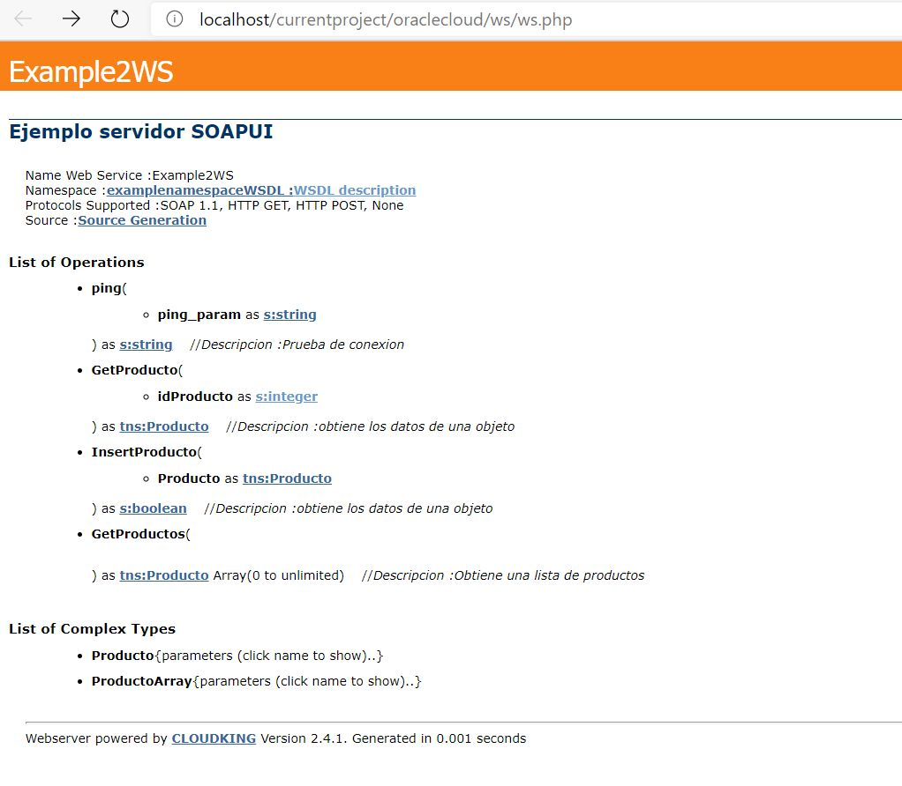
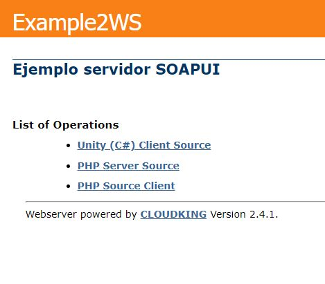
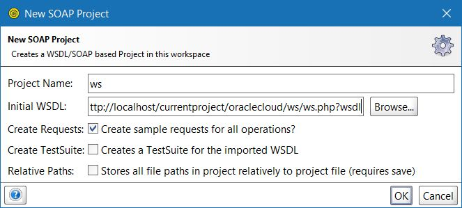

# cloudking
A SOAP Server Engine for PHP 5.6 and higher.

It supports SOAP 1.1, 1.2 or both.  JAVA usually supports 1.1, C# supports both.


[](https://packagist.org/packages/eftec/cloudking)
[](https://packagist.org/packages/eftec/cloudking)
[]()
[]()
[]()
[]()
[]()

Example of the UI



## Why we need Web Service SOAP?

Because some legacy projects are still using it.   SOAP it is also declarative (instead of REST that lacks of a specification)

And why to use this library?

* It generates the server (service class and the client)  
* It generates the WSDL.  
* It works with complex structures.  

## Getting started

### 1. Creating an instance

```php
use eftec\cloudking\CloudKing;
include "../vendor/autoload.php";

$FILE = 'http://'.$_SERVER["SERVER_NAME"].$_SERVER["SCRIPT_NAME"];
$NAMESPACE="examplenamespace";
$NAME_WS='Example2WS';
$ns=new CloudKing($FILE, $NAMESPACE, $NAME_WS);

$ns->soap12=false;
$ns->verbose=2;
$ns->allowed_format["POST"]=true;
$ns->variable_type="array";
// $service=new Example2WSService(); // we will work with this one later
// $ns->serviceInstance=$service; // we will work with this one later
$ns->description="Example Server";
```

You should create an instance indicating the url, namespace, and the name of the webservice.

You could also indicates other factors and it depends on every case. In case of doubt, you could use the cases indicates in this example.

This variable is important

```php
$ns->soap12=false;
```

JAVA usually doesn't work well with SOAP 1.2 (2.0) so we could disable it. By default, this library supports 1.1 and 1.2 (2.0) at the same time.


If you want to act as a server, then you could specify the instance

### 2. Assigning the Schema

This library starts creating the schema, you must create the schema manually and everything else is created based on it.

To start creating the schema, you must start adding a new function. You could specify the name of the function, the input, output and optionally, a description.

Example of a function that input a primitive and output a primitive:

```
$ns->addfunction("ping"
    , [CloudKing::argPrim('ping_param', 's:string')]
    , [CloudKing::argPrim('return', 's:string')]
    , "Descripcion :Prueba de conexion");
```

In this example, the input is an argument called **ping_param** (string) and the result (called return) is a string.

* s:**name** = means a primitive value
* tns:**Complex** = indicates a complex structure.

Example: getting a complex object

```php
$ns->addfunction("GetProducto"
    , [CloudKing::argPrim('idProducto', 's:integer')]
    , [CloudKing::argComplex('return', 'tns:Producto')]
    , "Descripcion :obtiene los datos de una objeto");
```

In this case, it uses an complex called tns:**Producto**   in the argument return. The name "return" could not be required.

You must also specific the complex structure as follow: 

```php
$ns->addtype("Producto", [ // because we use "tns:Producto"
    CloudKing::argPrim('idProduct', 's:integer'),
    CloudKing::argPrim('nombre', 's:string'),
    CloudKing::argPrim('precio', 's:integer')
]);
```

You could also create more complex types as follow

```php
$ns->addtype("Cart", [
    CloudKing::argList('products', 'tns:Producto', 0, 'unbounded'), // a list of products
    CloudKing::argPrim('total', 's:integer'), // a primitive
    CloudKing::argComplex('category', 'tns:category') // a complex not created for this example
]);
```

Example of function (input value is a complex):

```php
$ns->addfunction("InsertProducto"
    , array(CloudKing::argComplex('Producto', 'tns:Producto'))
    ,array(CloudKing::argPrim('return', 's:boolean'))
    , "Descripcion :obtiene los datos de una objeto"
);
```


Example: returning a list of objects

```php
$ns->addfunction("GetProductos"
    , []
    , [CloudKing::argList('return', 'tns:Producto', 0, 'unbounded')]
    , "Descripcion :Obtiene una lista de productos");
```

In this case, the function doesn't requires an input value and it returns a list of objects.

### 3. Running 

Finally, with the instance and the schema, you could run the interface

```
$ns->run();
```

And open the website to show the interface.

In the interface, you could see the WSDL, the methods and the generation of the code.

### 4. Generating the service class



You could generate the client or server (our service class). Let's generate the PHP Server Source.

This generated class lacks of the implementation but everything else is ready.

```php
class Example2WSService {
	function ping($ping_param) {
		try {
			// todo: missing implementation 
			/*
			$_ping_param='';
			*/
			// End Input Values 
			$_pingResult='';
			 return $_pingResult; 
		} catch (Exception $_exception) {
			return(array("soap:Fault"=>'Caught exception: '. $_exception->getMessage()));
		}
	}
	// ....
}
```

We should create a new PHP file, in our example **Example2WSService.php**

In the step 1, we create the instance of the CloudKing, with the service class up and running, we are ready to finish the implementation of the server.

Uncomment the next line of code (from the step 1)

```php
include "Example2WSService.php";
$service=new Example2WSService();
$ns->serviceInstance=$service;
```

And now, our web service is up and running and we could test into SOAPUI (or any other tools compatible with SOAP)



> Remember that in the main website, you could obtain the description WSDL. It is required for some programs (see image). You could also obtain by calling the webserver with the argument ?wsdl Example: myws.php?wsdl

### 5. Creating the client

We could create the client in the same way (with the UI) and we could change the webport and the default namespace.

```php
<?
class Example2WSClient {
	var $url='http://localhost/currentproject/oraclecloud/ws/ws.php';
	var $tempuri='examplenamespace';

	// Descripcion :Prueba de conexion 
	// ping_param =  
	function ping($ping_param) {
		$_obj=new CloudKingClient();
		$_obj->tempuri=$this->tempuri;
		$_obj->soap='1.1'
		$_param='';
		$_param.=$_obj->array2xml($ping_param,'ts:ping_param',false,false);
		$resultado=$_obj->loadurl($this->url,$_param,'ping');
		return @$resultado['pingResult'];
	}
	// ...
}
```

And you could call this class like any other service class

```php
$x=new Example2WSClient();
var_dump($x->ping(20));
```

## TODO

There is some broken features but it works in basic examples.

## Versions
* 2.5   
    * xml serialization changed   
* 2.4.1 A fix with the composer.json  
* 2.4 A new version   
