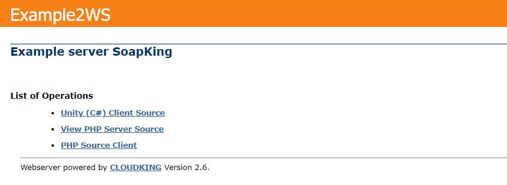
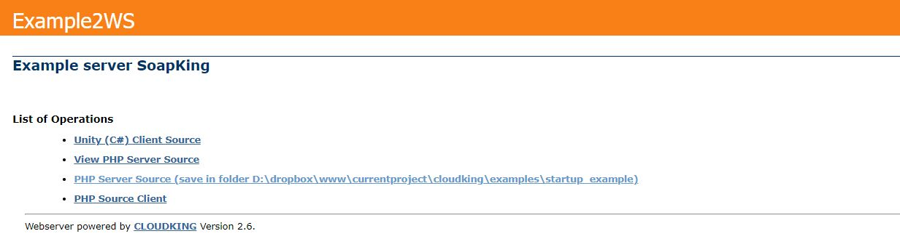
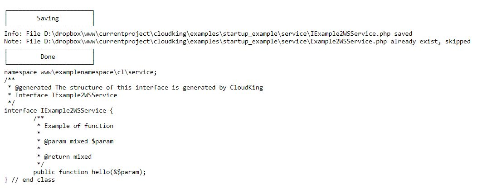
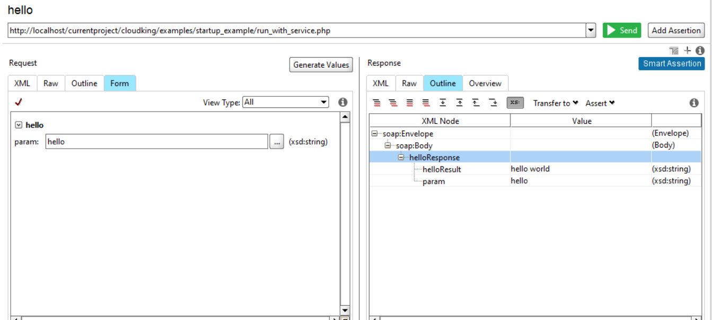

# cloudking
A SOAP Server Engine for PHP 5.6 and higher.

It supports SOAP 1.1, 1.2 or both.  JAVA usually supports 1.1, C# supports both.


[](https://packagist.org/packages/eftec/cloudking)
[](https://packagist.org/packages/eftec/cloudking)
[]()
[]()
[]()
[]()
[]()

Example of the UI


## Why we need Web Service SOAP?

Because some legacy projects are still using it.   SOAP it is also declarative (instead of REST that lacks of a specification)

And why to use this library?

* It generates the server (service class and the client)  
* It generates the WSDL.  
* It works with complex structures.  

## Getting started

### 1.Creating a Definition

What is a definition class. It is a class that defined the name,namespace, functions and complex-types defined by the web service.

In this example, we are defining a simple function : function hello($param); 

```php
class ExampleDefinition {
    public static $service;

    /**
     * You must create this file manually.
     *
     * @param bool $gui if true then it shows the web gui
     */
    public static function init($gui = true) {
        $FILE = 'http://' . $_SERVER['SERVER_NAME'] . $_SERVER['SCRIPT_NAME'];
        $NAMESPACE
            = 'http://www.examplenamespace.cl/'; // the namespace of the web service. It could be anything and not specifically an existing url
        $NAME_WS = 'Example2WS'; // the name of the service

        self::$service = new CloudKing($FILE, $NAMESPACE, $NAME_WS);
        self::$service->allowed_input['gui'] = $gui; // set to false to disable the web gui.
        self::$service->serviceInstance = null;
        self::$service->verbose = 2; // for debug purpose
        self::$service->description = 'Example server SoapKing';

        self::$service->addfunction('hello',
            [
                self::$service->param('param', 'string', true, false),
            ],
            [
                self::$service->param('return', 'string')
            ],
            'Example of function'
        );
    }

    public static function run() {
        $r = self::$service->run();
        echo $r;
    }
}
```

We will explain more about it later.

### 2. Running the first time.

Let's call the definition as follow

```php
<?php

include 'ExampleDefinition.php';

ExampleDefinition::init();
ExampleDefinition::run();
```

Right now, this web service doesn't run because we are not associate the definition with a real function. The functions are defined in a class SERVICE CLASS.


Here you have the definition of the services and the information about it. If you want to disable it, then you could disable the $GUI, or lower the VERBOSE to 0.

### 3. Calling the Service

Right now ,the service is not complete but you can test it.  If you click in WSDL description, it will show a huge xml file.  You could download it or copy the address (ended with ?wsdl)

In this example, we will use the program SOAPUI (there is a free and paid version)

Open the SOAPUI (or the program that you want to use), and paste the url of the wsdl (obtained in the previous step) and runs it.


And it will show all the methods defined. In our case, there is a single function called "hello". Then, you can run it.


If you run it, it will fail. Why? It is because we are yet to define the service class.

### 4. Service class

In our website, there is a link called SOURCE GENERATION.   Click on it and it will show the next screen.

You can generate a c# code, and both php code (from server and client). We need to generate the server source.  If you click on the View PHP Server Source, you can look at the code. However, you can also generate it directly.  However, for that, you will need to set the folder




Let's modify the file of the step 2

```php
<?php

include 'ExampleDefinition.php';

ExampleDefinition::init();
ExampleDefinition::$service->folderServer=__DIR__; // or you could select any folder.
ExampleDefinition::run();

```

And if we refresh the website, it will show



So, you could generate 1 class and 1 interface automatically. Click on it, and it will generate both files



It will generate the folder service and 2 files

📁 service

___ 📃 ExampleHelloService.php (our service class)

___ 📃 IExampleHelloService.php (the interface class)

### 5. Editing the Service Class.

This class is half-generated.  We could edit our operations inside this class, so let's change our code.

```php
class ExampleHelloService implements IExampleHelloService {

   /**
    * @inheritDoc
    */
   public function hello(&$param) {
      return $param." world!"; // <--- edit this.
   }
} // end class 
```

### 6. Editing our service

Let's modify our service defined in the step 2 again and now, we must indicate our service class (created in the step 4)

```php
ExampleDefinition::init();
ExampleDefinition::$service->folderServer=__DIR__; // or you could select any folder.run_initial.php
ExampleDefinition::$service->serviceInstance=new ExampleHelloService();
ExampleDefinition::run();
```

And let's run it again using SOAPUI



And now, we have the service up and running.

You could later disable the GUI

# Definition

## Parameters

Parameters are used to indicate the arguments of a function, the return value of a function or the fields of a complex structure.

#### Defining a single parameter.

> param(name of the parameter, type , reference, required , description)

* name of the parameter : it is the name of the parameter, for example "idCompany", "money" and such
* type: the type of the parameter. It could be a **primitive** value (string,integer,etc.) or it could be defined by a structure/class (called **complex**).  If we want to use a **complex** type, we need to define it after we want to use it.
* reference: (optional)If true then the value is also returned. If false, then the value is not returned.
* required: (optional)If true then the value is required.
* description: (optional) An optional description of the parameter.

```php
self::$service->param('counter', 'integer') // a parameter called "counter" of the type integer
self::$service->param('name', 'string', true, false, "description") // a string parameter called "name"
self::$service->param('prod', 'Product', true, false, "description") // a parameter called "prod" of the complex type Product (it must be defined)
```

#### Defining an array of parameters

It is also possible to define an array (list) of parameters.

> paramList(name of the parameter, type , reference, required , description )

```php
self::$service->paramList('names', 'string') // defining an array of string called "names"
self::$service->paramList('productList', 'Product',false,false,'List of products') // defining an array of complex type Product called "productList"
```

> Note: This function defines automatically a complex type called ArrayOf\<name of the parameter\> . If the complex type exists (complex with the same name), then it uses it instead of create a new one.

## Complex Types

It is also possible to define a complex type. A complex type is used when we need to define a model or structure.

> addType( name of the type , [ parameters ] , description)

* name of the type: it is the name of the time. The case of the name matters.
* parameters: We could define one of more parameters for the type.   We could even define list of parameters or even parameters that use complex types.
* description: (optional) The description of the type

```php
self::$service->addtype('Product',
    [
        self::$service->param('idProduct', 'int',false,true, 'comentary'),
        self::$service->param('name', 'string'),
        self::$service->param('price', 'int')
    ]);
```

Example: Defining a complex type of an invoice with the invoice detail.

```php
self::$service->addtype('InvoiceDetail', [
    self::$service->param('idInvoiceDetail', 'int'),
    self::$service->param('idInvoice', 'int'),
    self::$service->param('detail', 'string')
]);
self::$service->addtype('Invoice', [
    self::$service->param('idInvoice', 'int'),
    self::$service->paramList('details','InvoiceDetail'),
]);
```


## Versions
* 3.0
    * Rebuild the engine. Now SOAP and JSON works correctly.
* 2.6 
    * Fixed the client when it returns an array of objects.
* 2.5   
    * xml serialization changed   
* 2.4.1 A fix with the composer.json  
* 2.4 A new version   
